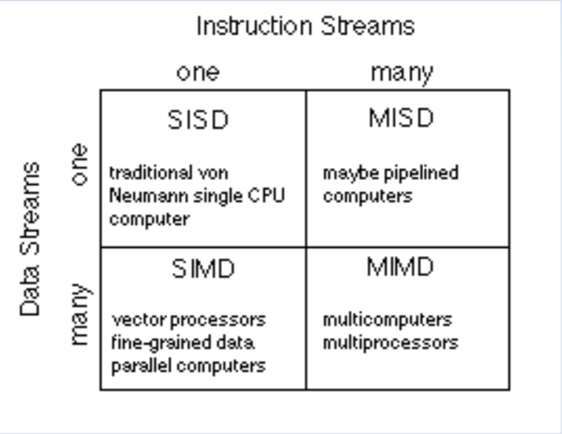
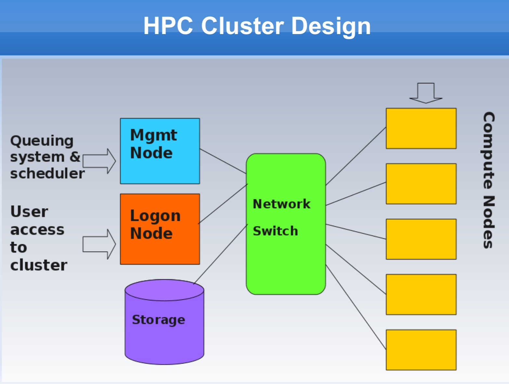
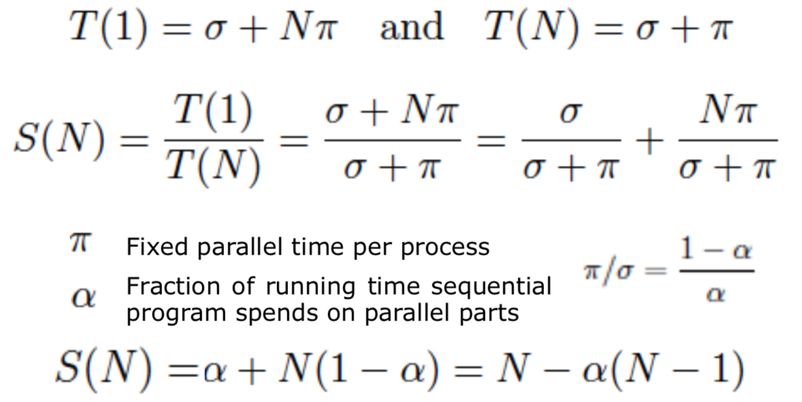
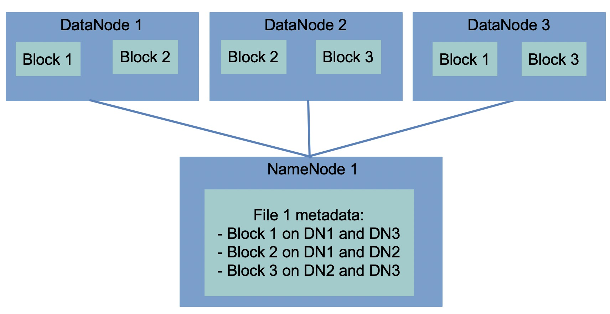
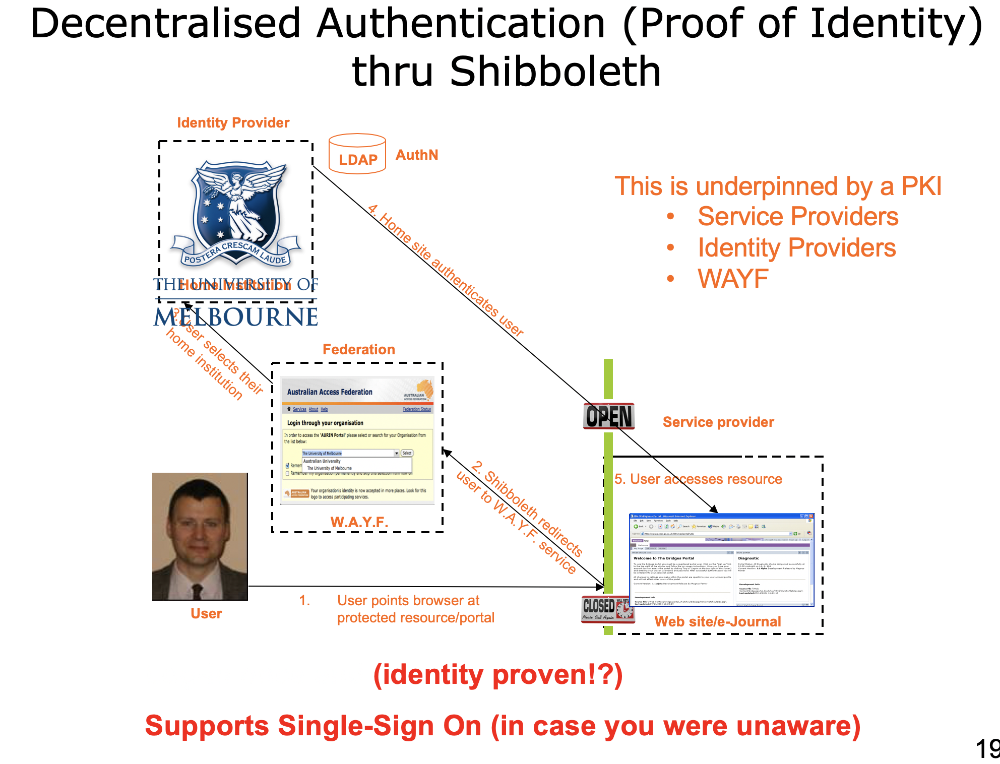
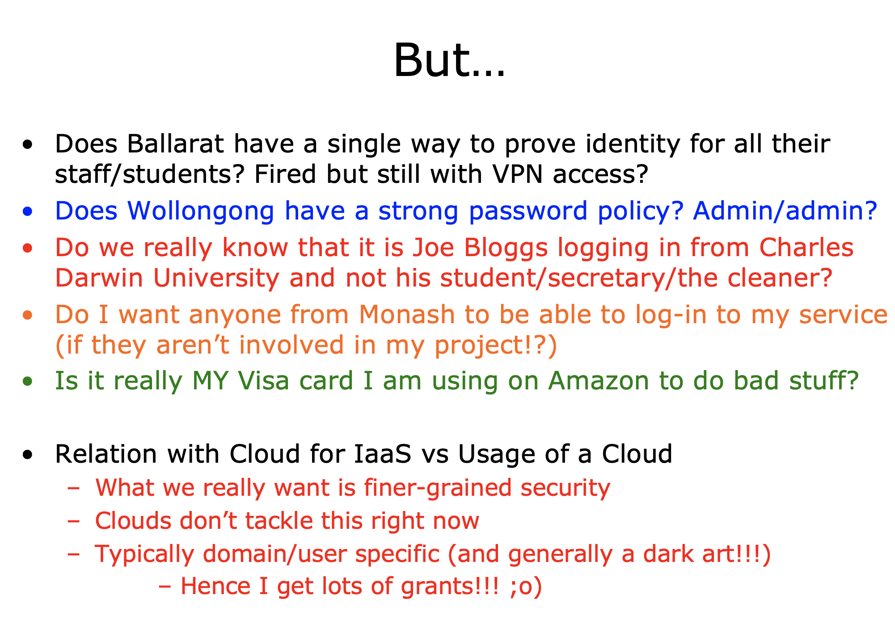

## 2014 Exam Answers

### Question 1

#### (1A)
**Major trends in research and research computing over the last 20 years that have led to the Cloud computing**

1. once had detailed standards
2. then had open distributed processing with slightly less strict and compliance(顺从的？) demands
3. Mid-90s: Transparency and Heterogeneity（异质）of computer interactions. Forcus on computer-computer interaction.

#### (1B)
**Evolution of service-oriented architecture support Cloud computing**

SoA Core ideas: 

- A set of externally facing services
- An architectural pattern based on service providers
- A set of architectural principles, patterns and criteria
- A programming model complete with standards, tools and technologies
- A middleware solution optimized for service assembly, orchestration, monitoring, and management

Two patterns to call services over HTTP:

- SOAP WS is built upon the Remote Procedure Call paradigm
过程远程调⽤用(RPC): 是⼀一个计算机通信协议。该协议允许运⾏行行于⼀一台计算机的程序调⽤用另⼀一 台计算机的⼦子程序，⽽而程序员⽆无需额外地为这个交互作⽤用编程。
- ReST is centered around resources, and the way they can be manipulated remotely.
- ReST is a style to use HTTP instead of a protocol
- SOAP is a stack of protocols that covers every aspect of using a remote service, from service discovery, balabala...

#### (1C)
**HTTP method idempotent**

Idempotent (幂等, 幂等是指重复调⽤用多次操作和进⾏一次操作的结果是一致的)

From a RESTful service standpoint, for an operation (or service call) to be idempotent, clients can make that same call repeatedly while producing the same result. 

**Example of idempotent ReST method**

GET, PUT, DELETE, HEAD, OPTIONS and TRACE are Idempotent

POST is not Idempotent

### Question 2

#### (2A)

**Public, private and hybrid Cloud computing models and their advantages and disadvantages**

- Private 
 - Pros: Control, Easier to secure, consolidation of resources, more trust
 - Cons: Utility challange, management overhead(超⽀), Hardware obsolescence(硬件过时),relevance to core business

- Public
 - Pros:Utility computing, Can focus on core business, cost-effective
 - Cons: Security proble, loss of control, possible lock-in 
 
- Hybrid
 - Pros: use privae cloud, but burst into public cloud when needed
 - Cons: how to move data?, how to decide which data to be public?

**"X as a Service(XaaS) models and their advantages and disadvantages"**

- Software as a Service (SaaS)
 - Gmail, office 365...
- Platform as a Service (PaaS)
 - Google App Engine, Amazon Elastic MapReduce
- Infrastructure(底部结构) as a Service (IaaS) (primary focus of this course) 
 - AWS, Orical Public Cloud, Nectar...

Advantages ???

#### (2B)

**Practical challenges in supporting Cloud interoperability(互用性，协调工作能力）**

(LMS Discussion Board)

Most major cloud interoperability challenges are related to vendor lock-in and lack of standardization (which can be used to lock in customers). Some practical examples are:

- Many Cloud providers don’t use standardized APIs to access their services, making it difficult to communicate with them and port infrastructure or applications to other providers.

- Many Cloud providers push their own internal formats for mission-critical aspects of cloud interoperability like the packaging of virtual machines.

- Providers difficult porting data efficiently (and cheaply) out of their control.

- On the policy side, the ownership of the data is sometimes not clear with cloud providers, putting an additional barrier for moving data out of the provider.

- Lack of single security solution (single sign-on and lack of single CA) and what data can go between clouds, e.g. what is private/public data etc.

### Question 3

#### (3A)

**Flynn's Taxnonmy**

1. Single Instruction, Single Data Stream (SISD)
2. Single Instruction, Multiple Data Stream (SIMD)
3. Multiple Instruction, Single Data Stream (MISD)
4. Multiple Instruction, Multiple Data Stream (MIMD)

  

**Implications of Flynn's taxonomy on modern computer architercture, give examples of consequences on multiple-core servers and clusters of servers such as Edward HPC facility**

It is possible to illustrate the degree of parallelisation by using Flynn's Taxonomy of Computer Systems (1966), where each process is considered as the execution of a pool of instructions (instruction stream) on a pool of data (data stream).

Over time computing systems have moved towards multi-processor, multi-core, and often multi-threaded and multi-node systems.

The engineering imperative to these systems comes down to heat. From the mid-2000s clock speed on CPUs have largely stalled.

Some trends include GPGPU development, massive multicore systems (e.g.,
The Angstrom Project, the Tile CPU with
1000 cores) and massive network connectivity and shared resources (e.g., Plan9 Operating System).

#### (3B)
**Features Edward HPC facility offer to allow utilization of multiple servers(nodes)**

With a cluster architecture, applications can be more easily parallelised across them. Parallel computing refers to the submission of jobs or processes over multiple processors and by splitting up the data or tasks between them (random number generation as data parallel, driving a vehicle as task parallel).

Research computing is the software applications used by a research community to aid research. This skills gap is a major problem and must be addressed because as the volume, velocity, and variety of datasets increases then researchers will need to be able to process this data.

 

#### (3C)
**Why cccuracy of the wall time estimate important to Edward end users?**

- Elapsed real time, real time, wall-clock time, or wall time is the actual time taken from the start of a computer program to the end. In other words, it is the difference between the time at which a task finishes and the time at which the task started.

- real time是从进行开始执行到完成所经历的墙上时钟时间（wall clock）时间，包括其他进程使用的时间片（time slice）和本进程耗费在阻塞（如等待I/O操作完成）上的时间。

### Question 4

#### (4A)
**Gustafson-Barsis' law**

- Gives "Scaled Speed-up"
- Propose that programmers tends to set the size of the problems to use the available equipment to solve problem within a practical fixed times. Faster (more parallel) equipment available, larger problems can be solved in the same time.

  

- Typo in pic  -> **alpha**: fraction of running time sequential program spends on non-parallel parts

#### (4B)
**A parallel program takes 128 seconds to run on 32 processors. The total time spent in the sequential part of the program is 12 seconds. What is the scaled speedup?**

Here alpha = (128-12)/128 = 116/128 so the scaled speed up is (116/128) + (1 - 116/128)*32 = approx 29. 

#### (4C)
**According to Gustafson-Barsis' law, how much faster could the application theoretically run if it ran across all 32 processors compared to running on a single processor?**

Question C) was a bit nasty in that the answer should indeed be 29 times faster so why the heck was it worth 3 points when it was so obvious. Fact is though that the majority of students got this question wrong when really it was just taking the equation from lecture 3 and putting in some numbers and confirming you understand speed-up.

#### (4D)

**Why theoretically italicized in the above**

???

### Question 5

#### (5A)

**Advantages and disadvantages of unstructured databases such as CouchDB for dealing with 'big data' compared to more traditional database**

NoSQL:

- traditional RDBMS are good at consistency, but the data are normalized, which is no longer granted for big data.

- Alternative query languages for distributed DB, not only SQL - NoSQL DBMS 

- Key-Value store
	- allows the retrieval of a chunk of data given a key, fast, but crude
- BigTable DMBS
	- stores data in columns grouped into column families
- Doc-oriented DBMS
	- stores data as structured docs, like XML or JSON (like CouchDB, MongoDB)

Challenges with data Distribution: Volume (数据量量) Velocity (速度) Variety (多样性) Veracity (准确性)

Traditional database ACID properties: In computer science, ACID (Atomicity, Consistency, Isolation, Durability) is a set of properties of database transactions intended to guarantee validity even in the event of errors, power failures, etc. In the context of databases, a sequence of database operations that satisfies the ACID properties (and these can be perceived as a single logical operation on the data) is called a transaction. For example, a transfer of funds from one bank account to another, even involving multiple changes such as debiting one account and crediting another, is a single transaction.

Heterogeneity of data: means that there is variability in the data.

large-scale data processing: ??? 

#### (5B)
**Role of HDFS in supporting the Apache Hadoop framework**

A HDFS file is a collection of blocks stored in datanodes, with metadata (such as the position of those blocks) that is stored in namenodes

简单来说: Namenode只存元数据，只知道具体数据在哪但是不不知道具体数据. DataNode负责 存具体的数据块. ⽤用户查询的时候先从NameNode那⾥里里拿到具体数据块在那个DataNode上，再 去DataNode请求数据. 因为怕NameNode爆炸, 所以NameNode只负责告诉你数据在哪⽽而不不返 回具体数据. (跟GFS的master-slave原理理应该是⼀一样的)

 

**Process of Apache Hadoop supports fault tolerant data processing**

The core of Hadoop is a fault tolerant file system that has been explicitly designed to span many nodes

HDFS blocks are much larger than blocks used by an ordinary file system (say, 4 KB versus 128MB), the reasons for this unusual size are:

- Reduced need for memory to store information about where the blocks are (metadata)
- More efficient use of the network (with a large block, a reduced number network connections needs to be kept open)
- Reduced need for seek operations on big files
- Efficient when most data of a block have to be processed

### Question 6

#### (6A)

**Federated authentication**

Federated Identification (联合身份)

Federated identity is related to single sign-on (SSO), in which a user's single authentication ticket, or token, is trusted across multiple IT systems or even organizations. 

信息技术中的联合身份是将⼈人的电⼦子身份和属性联系起来的⼿手段，存储在多个不不同的身份管理理 系统中。 联合身份与单点登录相关，其中⽤用户的单⼀一身份验证票证或令牌在多个IT系统甚⾄至组 织中受信任。

**Single sign-on**

Single sign-on (单点登录)

A property of access control of multiple related, yet independent, software systems. With this property, a user logs in with a single ID and password to gain access to any of several related systems. 

当⽤用户登录时，就可以获取所有系统的访问权限，不不⽤用对每个单⼀一系统都逐⼀一登录

**Role of Trust in Shibboleth model**

**Role of Public Key Infrastructures in Shibboleth model**

 

**Advantages and disadvantages of the Shibboleth approach**

Shibboleth is a single sign-on log-in system for computer networks and the Internet. It allows people to sign in using just one identity to various systems run by federations of different organizations or institutions. The federations are often universities or public service organizations.

 

**Why isn't Shibboleth used to access Cloud-based systems more generally?**

Security challenges:

 - **Authentication** 身份鉴定
 
 - **Authorisation** 授权

 - **Audit** 审计

 - **Confidentiality** 保密性

 - **Privacy** 隐私

 - **Fabric management** 组织管理理

 - **Trust** 信任

 - **Single sign-on**: 

   1. The Grid model needed
   2. Currently not solved for Cloud-based Iaas
   3. Onus is non-Cloud developers to define this

 - **Auditing**: logging, intrusion detection, auditing of security in external computer facilities.

 - **Deletion**: 
   1. data deletion with no direct hard disk
   2. scale of data

 - **Liabiliry**

 - **Licensing**: 

   1. many license models
   2. challenges with the cloud delivery model

 - **Workflows**:

	1. Many workflows tools for combing SoA services
	2. Many workflows models.
	3. Serious challenges of defining, enforcing, sharing, enacting
	4. Security-oriented workflows

### Question 7

#### (7A)

**Hypervisor** :The virtulisation layer between the underlying hardware and the VMs and guest operating systems it supports.

**Virtual machine** : A representation of a real machine using hardware/software that can host a guest operating system

**Machine image** : 

**Object store** : (from wiki) is a computer data storage architecture that manages data as objects

**Volume store** :

**Key-pair** :

#### (7B)

**Applications can be deployed on Clouds by: Creations and deployment of virtual images (snapshots) . Or through scripting the installation and configuration of software applications.**

**a. benefits and drawbacks of the two approches**  

- Snapshot
	- Benefits: easy to create snapshot and copy the state of one VM to another, no need to write script, easy to operate when deploying small number of VMs
	- Drawbacks: Requires mass labor work when have hundreds of instances to deploy. Deploying complex cloud systems requires a lot of moving parts. Easy to forget what software you installed, and what steps you took to configure the system

- Automation
	- Benefits: Provides a record of what you did, Codifies knowledge about the system, Makes process repeatable and programmable
	- Drawbacks: Have to program and test the scripts mannually. More labor work when the cloud is small. 

**b. Mechanisms used to support these approaches. Refer to specific tools used to support these processes on the Nectar research cloud**

 - Snapshot: NeCTAR Cloud support image service that users can create their own snapshots or use exsisting snapshots of virtual images.
 - Automation: Ansible - An automation tool for configuring and managing computers. Finer grained set up and configuration of software packages

