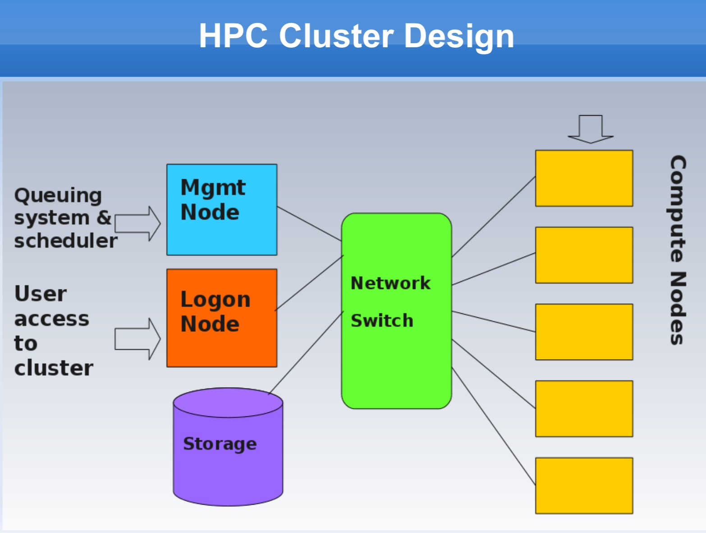
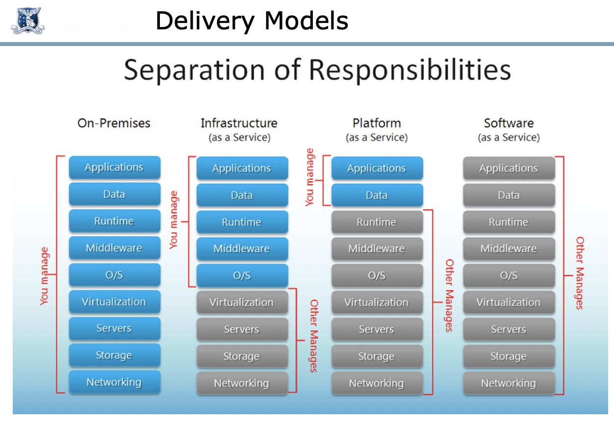

# Review Outlines
## Week 1 - History of Cloud Computing and Grid Computing  
1. Cloud Characteristics
	- On-demand (按需) self-service  
	- Networked access  
	- Resource pooling  
	- Rapid elasticity  
	- Measured service
2. Flavours
	- Compute clouds  
	- Data clouds  
	- Application clouds  
	- balabala clouds, etc..  
3. Brief history  
	1)  once had detailed standards  
	2) then had open distributed processing with slightly less strict and compliance(顺从的？) demands  
	3) Mid-90s: **Transparency** and **Heterogeneity**（异质）of computer interactions. Forcus on **computer-computer interaction**.  

4. Grid Computing  
**Grid computing is a processor architecture that combines computer (may be heterogeneous or hypogeneous) resources from various domains to reach a main objective.** In grid computing, the computers on the network can work on a task together, thus functioning as a supercomputer.

## Week 2 - Domain Drivers  
1. Problem
	- More and more data, databases  
	- Distributed, completely heterogeneous data  
	- Data is messy
2. Solution: Cluster and Cloud Computing.  
	Where is Domain drivers computing??????  F\*\*K Richard.  

3. Domain-driven design (From wiki)
Domain-driven design (DDD) is an approach to software development for complex needs by connecting the implementation to an evolving model.  
领域驱动设计是一种通过将实现连接到持续进化的模型来满足复杂需求的软件开发方法.  

## Week 3 - Overview of Distributed and Parallel Computing Systems  
1. Compute Scaling
	- Vertical Computational Scaling (Faster processors)
	- Horizontal Computational Scaling (More processors): Easy to add more, but hard to design and develop. 
	
2. Approaches for Parallelism
	- **Explicit**(明确的) vs **Implicit**(含蓄的) parallelism
		- **Implicit**: Supported by parallel languages and parallelizing compliers. Hard to do.
		- **Explicit**: The programmer is responsible for most of the parallelization effor. Consider SPARTAN.
	- Hardware  
	- Operating System
	- Software / Applications
	- Some or all of those
	
3. Design Stages of Parallel Programs (很像map-reduce?)
	- Partitioning(分割)
	- Communication
	- Agglomeration(聚集)
	- Mapping / Scheduling
	
4. **Erroneous Assumptions of Distributed Systems**
	- The network is reliable  
	- Latency is zero  
	- Bandwidth is infinite
	- The network is secure
	- Topology does not change
	- There is one administrator
	- Transport cost is zero
	- The network is homogeneous
	- Time is ubiquitous(普遍存在的)
	
5. **Challenges with Distribution**
	- Single point failure.
	- General assumptions that typically do not hold in the real world.
	- Dependene analysis is hard for core that uses pointers, recursion, ...;
	- Loops can have unknown number of iterations
	- Access to global resources (e.g. Shared variables)  
	
6. Parallelisation Paradigms(范例)
	- Master Worker/Slave Model
	- Single-Program, Multiple-Data
	- Data Pipelining
	- Divide and Conquer
	- Speculative(投机的) Parallelism 
	- Parametric Computation  

## Week 4 - Spartan HPC System
1. HPC:  
High-performance computing (HPC) is any computer system whose architecture allows for above average performance. A system that is one of the most powerful in the world, but is poorly designed, could be a "supercomputer".

2. Clustered Computing:   
Clustered computing is when two or more computers serve a single resource.  

3. HPC Cluster Design: 
  

4. Use Spartan:  
	1) Logging in  
	2) Submitting and Running jobs with scripts
5. Shared Memory vs. Distributed Memory
	- Multi-threads: Shared Memory
	- MPI: Distrubuted Memory Parallel Programming

## Week 5 - Cloud Computing, NeCTAR, Ansible, Git
1. The Most Common Cloud Models
	- Deployment Models
		- Private
			- Control, secure, consolidation of resources
			- Utility challange, management overhead(超支)
		- Public
			- Utility computing, Can focus on core business, cost-effective
			- Security proble, loss of control, possible lock-in
		- Community
		- Hybrid (杂交)
			- use privae cloud, but burst into public cloud when needed
			- how to move data?, how to decide which data to be public?
	- Delivery(交付) Models
		- Software as a Service (SaaS)
			- Gmail, office 365...
		- Platform as a Service (PaaS)
			- Google App Engine, Amazon Elastic MapReduce
		- Infrastructure(底部结构) as a Service (IaaS) (primary focus of this course)
			- AWS, Orical Public Cloud, Nectar...  

	  
	
2. Essential Characteristics (Same as week 1)
	- On-demand self-service (随需自动服务）
	- Broad network access (随时随地用任何网络存取)
	- Resource pooling (多人共享资源池)
	- Rapid elasticity (快速重新部署灵活度)
	- Measured service (被监控与测量的服务)  

3. NeCTAR Research Cloud
	- Based on OpenStack
	- Services
		- Compute service, Image service, Block storage service, object storage service ...

4. Automation (Ansible, specifically)
	- Deploying complex cloud systems requires a lot of moving parts
	- Automation provides a record of what you did
	- Codifies knowledge about the system
	- Makes provess repeatable and programmable

5. Ansible
	- Easy to learn: Playbooks in YAML, templates in Jinja2, sequential execution.
	- Minimal requirements: Single command to install, uses ssh to connect to target machine
	- Repeatable
	- Extensible
	- Supports push or pull
	- Rolling updates
	- Intentory management (存货管理？)

6. Git
	- Distributed (decentralized) version-control system. 
	- Keep tracking changes
	- Revert to a specific checking point
	- Work with people

# Week 6 - Web Services, ReST Services, Twitter, Docker and Containerisation

