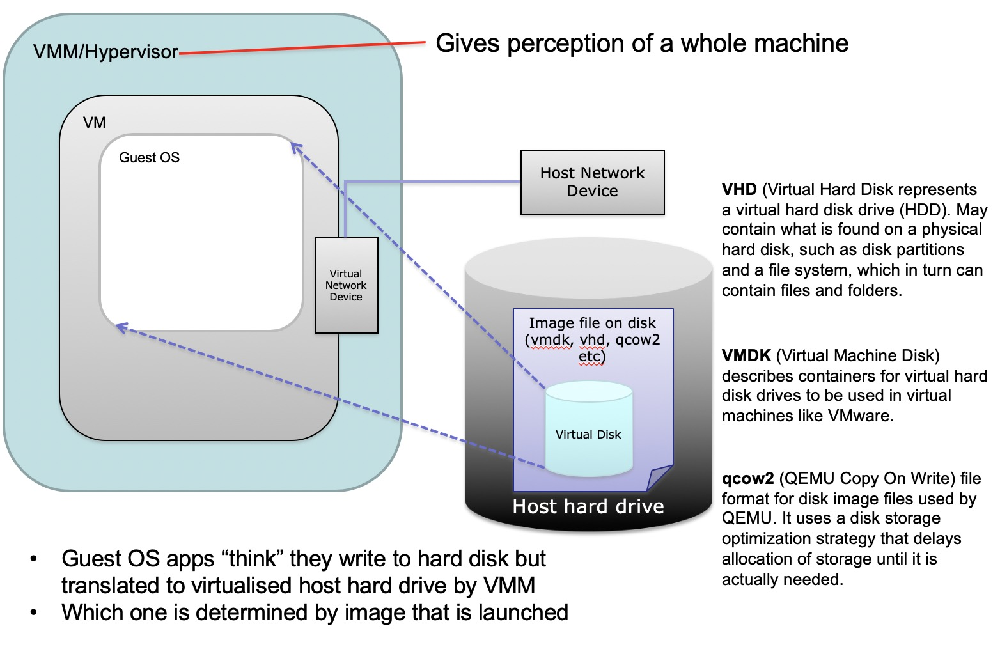

# Review Outlines
## Week 1 - History of Cloud Computing and Grid Computing  
1. Cloud Characteristics
	- On-demand (按需) self-service  
	- Networked access  
	- Resource pooling  
	- Rapid elasticity  
	- Measured service
2. Flavours
	- Compute clouds  
	- Data clouds  
	- Application clouds  
	- balabala clouds, etc..  
3. Brief history  
	1)  once had detailed standards  
	2) then had open distributed processing with slightly less strict and compliance(顺从的？) demands  
	3) Mid-90s: **Transparency** and **Heterogeneity**（异质）of computer interactions. Forcus on **computer-computer interaction**.  

4. Grid Computing  
**Grid computing is a processor architecture that combines computer (may be heterogeneous or hypogeneous) resources from various domains to reach a main objective.** In grid computing, the computers on the network can work on a task together, thus functioning as a supercomputer.

## Week 2 - Domain Drivers  
1. Problem
	- More and more data, databases  
	- Distributed, completely heterogeneous data  
	- Data is messy
2. Solution: Cluster and Cloud Computing.  
	~~Where is Domain drivers computing??????~~  

3. Domain-driven design (From wiki)
Domain-driven design (DDD) is an approach to software development for complex needs by connecting the implementation to an evolving model.  
领域驱动设计是一种通过将实现连接到持续进化的模型来满足复杂需求的软件开发方法.  

## Week 3 - Overview of Distributed and Parallel Computing Systems  
1. Compute Scaling
	- Vertical Computational Scaling (Faster processors)
	- Horizontal Computational Scaling (More processors): Easy to add more, but hard to design and develop. 
	
2. Amdahl's Law

3. Gustafson-Barsis's Law
	

4. Computer Architectures (Flynn's Taxonomy)
	- SISD (Single instruction, Single Data stream
		- Single control unit (CU/CPU) fetches single Instruction Stream from memory.
	- SIMD (Single instruction, Multiple Data streams)
		- multiple processing elements that perform the same operation on multiple data points simultaneously. (Image processing)
	- MISD (Multiple instruction, Single Data stream)
		- Parallel computing architecture where many functional units (PU/CPU) perform different operations on the same data. (Not common)
	- MIMD (Multiple instruction, Multiple Data streams)		- number of processors that function asynchronously and independently (HPC)
	
2. Approaches for Parallelism
	- **Explicit**(明确的) vs **Implicit**(含蓄的) parallelism
		- **Implicit**: Supported by parallel languages and parallelizing compliers. Hard to do.
		- **Explicit**: The programmer is responsible for most of the parallelization effor. Consider SPARTAN.
	- Hardware  
	- Operating System
	- Software / Applications
	- Some or all of those
	
3. Design Stages of Parallel Programs (很像map-reduce?)
	- Partitioning(分割)
	- Communication
	- Agglomeration(聚集)
	- Mapping / Scheduling
	
4. **Erroneous Assumptions of Distributed Systems**
	- The network is reliable  
	- Latency is zero  
	- Bandwidth is infinite
	- The network is secure
	- Topology does not change
	- There is one administrator
	- Transport cost is zero
	- The network is homogeneous
	- Time is ubiquitous(普遍存在的)
	
5. **Challenges with Distribution**
	- Single point failure.
	- General assumptions that typically do not hold in the real world.
	- Dependene analysis is hard for core that uses pointers, recursion, ...;
	- Loops can have unknown number of iterations
	- Access to global resources (e.g. Shared variables)  

6. Strategies for Development of Parallel/Distributed Systems
	- Automatic parallelization
	- Parallel strategies
	- Major Recording

7. Design Stages of Parallel Programs
	- Partitioning
	- Communication
	- Agglomeration
	- Mapping

	
8. Parallelisation Paradigms(范例)
	- Master Worker/Slave Model
		- Masterdecomposesthe problem into small tasks, distributes to workers and gathers partial results to produce the final result
	- Single-Program, Multiple-Data (SPMD)
		- Each process executes the same piece of code, but on different parts of the data. Data is typically split among the available processors. 
	- Data Pipelining
		- Suitable for applications involving multiple stages of execution, that typically operate on large number of data sets.
	- Divide and Conquer
		- Aproblemisdividedinto two or more sub problems, and each of these sub problems are solved independently, and their results are combined. 
		- 3 operations:split, compute, and join
		- Master-worker / **task-farming** is like divide and conquer with master doing both split and join operation.
	- Speculative(投机的) Parallelism 
	- Parametric Computation

	
## Week 4 - Spartan HPC System
1. HPC:  
High-performance computing (HPC) is any computer system whose architecture allows for above average performance. A system that is one of the most powerful in the world, but is poorly designed, could be a "supercomputer".

2. Clustered Computing:   
Clustered computing is when two or more computers serve a single resource.  

3. HPC Cluster Design: 

  

4. Use Spartan:  
	1) Logging in  
	2) Submitting and Running jobs with scripts
5. Shared Memory vs. Distributed Memory
	- Multi-threads: Shared Memory
	- MPI: Distrubuted Memory Parallel Programming

## Week 5 - Cloud Computing, NeCTAR, Ansible, Git
1. The Most Common Cloud Models
	- Deployment Models
		- Private
			- Control, secure, consolidation of resources
			- Utility challange, management overhead(超支)
		- Public
			- Utility computing, Can focus on core business, cost-effective
			- Security proble, loss of control, possible lock-in
		- Community
		- Hybrid (杂交)
			- use privae cloud, but burst into public cloud when needed
			- how to move data?, how to decide which data to be public?
	- Delivery(交付) Models
		- Software as a Service (SaaS)
			- Gmail, office 365...
		- Platform as a Service (PaaS)
			- Google App Engine, Amazon Elastic MapReduce
		- Infrastructure(底部结构) as a Service (IaaS) (primary focus of this course)
			- AWS, Orical Public Cloud, Nectar...  

	  
	
2. Essential Characteristics (Same as week 1)
	- On-demand self-service (随需自动服务）
	- Broad network access (随时随地用任何网络存取)
	- Resource pooling (多人共享资源池)
	- Rapid elasticity (快速重新部署灵活度)
	- Measured service (被监控与测量的服务)  

3. NeCTAR Research Cloud
	- Based on OpenStack
	- Services
		- Compute service, Image service, Block storage service, object storage service ...

4. Automation (Ansible, specifically)
	- Deploying complex cloud systems requires a lot of moving parts
	- Automation provides a record of what you did
	- Codifies knowledge about the system
	- Makes provess repeatable and programmable

5. Ansible
	- Easy to learn: Playbooks in YAML, templates in Jinja2, sequential execution.
	- Minimal requirements: Single command to install, uses ssh to connect to target machine
	- Repeatable
	- Extensible
	- Supports push or pull
	- Rolling updates
	- Intentory management (存货管理？)

6. Git
	- Distributed (decentralized) version-control system. 
	- Keep tracking changes
	- Revert to a specific checking point
	- Work with people

## Week 6 - Web Services, ReST Services, Twitter, Docker and Containerisation
1. SoA (Service-oriented Architectures)  
	When components are distributed, they have to interact in more loosely-coupled ways instead communicate directly.
	
2. SoA Core ideas
	- A set of externally facing services
	- An architectural pattern based on service providers
	- A set of architectural principles, patterns and criteria
	- A programming model complete with standards, tools and technologies
	- A middleware solution optimized for service assembly, orchestration, monitoring, and management

3. SoA Design Principles  

	Principle | Chinese | Description
	:---- | :--- | :--- 
	Standardized service contract | 标准服务契约 | 服务要遵循一个服务描述
	Service loose coupling |  服务松耦合 | 服务之间的依赖要最小化
	Service abstraction | 服务抽象 | 服务将自己的业务逻辑封装起来，对外部世界是隐藏的
	Service reusability | 服务复用 | 业务逻辑切割成多个服务以实现复用的最大化
	Service autonomy | 服务自治 | 服务应该有对它们封装的逻辑的控制权
	Service statelessness | 服务无状态 | 理想情况下，服务应该是没有状态的
	Service discoverablity | 服务发现 | 服务可以被发现，通常通过一个接口注册
	Service composability | 服务组合 | 一个大问题可以被分割成很多小问题
	Service granularity | 服务粒度 | 选择合适的服务粒度
	Service normalization | 服务标准化
	Service optimization | 服务最优化
	Service relevance | 服务关联
	Service encapsulation | 服务封装 | 内部实现对用户是隐藏的
	Service location transparency | 服务地点透明 | 用户可以调用服务而无论服务的实际网络位置是什么

4. SoA for the Web: Web Services
	- Web services used to implement service-oriented architectures
	- Web服务是一种服务导向架构的技术，通过标准的Web协议提供服务，目的是保证不同平台的应用服务可以互操作 (from wiki)
	- Two main flavours
		- SOAP-based web services (Simple Object Access Protocol - 简单对象访问协议, 数据交换的协议规范, 交换带结构信息)
		- ReST-based web services (Representational State Transfer - 表现层状态转移, 资源在网络中以某种表现形式进行状态转移)
	- Both use HTTP, hence can run over the web

5. SOAP vs ReST
	- Two patterns to call services over HTTP
	- SOAP WS is built upon the **Remote Procedure Call** paradigm
		- 过程远程调用(RPC): 是一个计算机通信协议。该协议允许运行于一台计算机的程序调用另一台计算机的子程序，而程序员无需额外地为这个交互作用编程。
	- ReST is centered around resources, and the way they can be manipulated remotely.
	- Actually **ReST is more of a style** to use HTTP than a separate protocol 
	- **SOAP is a stack of protocols** that covers every aspect of using a remote service, from service discovery, to service description, to the actual request/response

6. WSDL - Web Services Description Language (Web 服务描述语言, SOAP使用WSDL)
	- An XML-based interface description language that describes the functionality offered by a web service.
	- WSDL provides a **machine-readable** description.
		- How the service can be called
		- what parameters it expects
		- what results/data structures it returns

7. Resource-Oriented Architecture (ROA)
	- ROA is a way of turning a problem into a ReSTful web service
		- Everything in ReST is considered as resource
		- Client requests resources through URL, an URL is a resource
		- Use POST，GET，PUT，DELETE orperations to create, retrieve, update, and delete resource, use uniform interface
	- Procedure
		- Client requests resource through URL
		- Server sends representation of resource
		- This puts the client in a certain state
		- Representation contains URLs allowing navigation
		- Client follows URL to fetch another resource
		- This transitions client into another state

8. ReST best practices
	- Keep your URLs short
	- URLs should be opaque (不透明的) ids that are meant to be discovered by following hyperlinks, not by client
	- Use nouns, not verbs
	- Make all GETs side-effect free to make request safe
	- Use links in your responses to requets, the response itself contains info about what's the next step to take
	- Minimize the use of query strings
	- Use HTTP status codes to convey errors/success

9. ReST principles
	- Addressability (可寻址能力)
	- Uniform Interface
	- Resources and Representations instead of RPC (Remote Procedure Call Protocol - 过程远程调用， C/S架构)
		- RPC need to expose the availables functions, but ReSTful systems no need to learn about functions, just find resources by following links from other resources
	- HATEOAS (Hypermedia as the Engine of Application State - 超媒体作为应用状态的引擎)
		- Resources representations contain links to identified resources
		- Making resources **Navigatable**

10. HTTP Methods
	- HTTP methods can be
		- Safe
		- Idempotent (幂等, 幂等是指重复调用多次操作和进行一次操作的结果是一致的)
		- Neither
	- Safe methods
		- Do not change, repeating a call is equivalent to not making a call at all
	- Idempotent methods
		- Effect of repeating a call is equivalent to making a single call
	- GET, OPTIONS, HEAD - Safe
	- PUT, DELETE - Idempotent
	- POST - Neither safe nor idempotent

11. ReST 2.0
	- Motivation
		- Everything as a service (EaaS)
		- Vast number of entities and services
		- Link services together to create workflows and mashups (混搭)
	- Solution
		- Extend API notation from mainly desktop applications to web apps and mobile platforms
		- Create API hubs that aim to facilitate the sharing and usage of services

12. Containerisation
	- Similar concept of resource **isolation** and **allocation** as a VM
	- Without bundling the entire hardware env. and full OS
	- Containerization allows **virtual instances** to share a single host OS to reduce these wasted resources (drivers, binaries, libraries), since each container only holds the application and related binaries. The rest are shared among the containers.
	- Virtualization vs Containerization  

		Virtualization | Containerization 
		:---- | :--- 
		Run on virtual hardware, have own OS kernels | Share same OS kernel
		Communication through Ethernet devices | IPC mechanisms (pipes, sockets)
		Security depends on hypervisor | Security requires close scrutiny (监视)
		A bit slow performance | near native performance
		File systems and libraries are not shared | File systems can be shared, libraries are shared
		Slow startup time | fast startup time
		Large storage | Small storage
		
13. Docker (Container Orchestration tool)
	- Docker is currently the leading software container platform
	- Container: a process behaves like an independent machine
	- Image: a blueprint for a container
	- Dockerfile: the recipe to create an image

## Week 7 - Big Data and CouchDB

1. Big Data Challanges - The four **"Vs"**
	- Volume (数据量)
	- Velocity (速度)
	- Variety (多样性)
	- Veracity (准确性)

2. NoSQL
	- Traditional RDBMS are good at consistency, but the data are normalized, which is no longer granted for big data.
	- Alternative query languages for distributed DB, <u>not only SQL - NoSQL DBMS</u>
	- Key-Value store
		- allows the retrieval of a chunk of data given a key, fast, but crude
	- BigTable DMBS
		- stores data in columns grouped into column families
	- Doc-oriented DBMS
		- stores data as <u>structured docs</u>, like XML or JSON (like CouchDB, MongoDB)

3. CouchDB Cluster Architecture (省略了一些)
	- <u>Nodes (几个节点), shards (每个表切几片), replica (重复几次, CouchDB里的n)</u>
	- All nodes answer requests (read or write) at the same time
	- Sharding (splitting of data across nodes) is done on every node
	- When a node does not contain a doc when the request comes, the node requests it from another node and returns to the client
	- Nodes can be added / remove easily, the data re-balanced automatically
	- Primary node fails, a sub-node is chosed as primary node automatically

4. CAP: Consistency, Availability, Partition-Tolerance - 一致性，可用性，容错性
	- **Consistency**: every client receiving an answer receives <u>the same answer</u> from all nodes in the cluster
	- **Availability**: every client receives <u>an answer</u> from any node in the cluster
	- **Partition-Tolerance**: the cluster <u>keeps on operating</u> when one or more nodes cannot communicate with the rest of the cluster  
	

  

5. Consistency and Avalibility: **Two phase commit** (两阶段提交)
	- 所有子节点都提交以后再完成事物，否则回滚。
	- reduced availability, but enforced consistency
	- Good when clister is co-located(同地协作), less good when it is distributed

6. Consistency and Partition-Tolerance: **Paxos Algorithm**
	- 针对基于消息传递的分布式模型的系统，为了保证一致性和容错性
	- 每个节点是一个proposer或accepter，也可以同时都是
		- proposer提出一个提案 (proposal)，带有timestamp或id
		- accepter可以接受也可以拒绝，未经批准的叫提案 (proposal)，批准了的叫决议 (value)
		- 若提案获得多数派 (majority) 的acceptor的接受，则该提案被批准 (chosen)

7. Availability and Partition-tolerance: **Multi-version Concurrency Control (MVCC)** (多版本并发控制)
	- MVCC意图解决读写锁造成的多个、长时间的读操作饿死写操作问题。每个事务读到的数据项都是一个历史快照（snapshot)并依赖于实现的隔离级别。写操作不覆盖已有数据项，而是创建一个新的版本，直至所在操作提交时才变为可见。快照孤立使得事物看到它启动时的数据状态 (from wiki)
	- MVCC可以确保每个事务(T)通常不必“读等待”数据库对象(P)。这通过对象有多个版本，每个版本有创建时间戳 与废止时间戳 (WTS)做到的. (CouchDB 用的这个，当版本号冲突的时候会报错）

8. Sharding and Replication
	- Sharding: partitioning the DB horizontally. ***q*** in CouchDB
	- Replication: Action of storing the same row (or doc) on different nodes to make DB fault-tolerant. ***n*** in CouchDB (usually set as 3, no larger than the numebr of nodes)
	- n * q is the total number of shard files

9. MapReduce Algorithms
	- Map: Distributes data across machines
	- (Suffle, not introduced in ppt)
	- Reduce: Summarize the mapped data until the result is obtained

10. CouchDB Features
	- Doc-oriented DMBS
	- HTTP ReST API
	- Web-based admin interface
	- Web-ready
	- Supports MapReduce (with JS)
	- Supports Mango queries (JSON)
	- Supports replication, sharding, clusters
	- CouchDB Views: Views are fast and store aggregated data, but are inflexible and use a lot of storage
		- CouchDB实际上用了一种lazy的方法来实现view, 当MapReduce的view被提交的时候view不会被立即生成，只有当第一次使用的时候才会计算生成，通常需要很长时间

## Week 8 - Big Data Analytics, Hadoop, Spark  

1. **Challenges of Big Data Analytics** - A framework for analysing big data has to distribute both data and processsing over many nodes, which implies:
	- Reading and writing distributed datasets
	- Preserving data in the presence of failing data nodes
	- Supporting the execution of MapReduce tasks
	- Being fault-tolerant
	- Coordinating the execution of tasks across a cluster
2. HDFS Architecure
	- A HDFS file is a collection of blocks stored in ***datanodes***, with metadata (such as the position of those blocks) that is stored in ***namenodes***
	 - 简单来说: Namenode只存元数据，只知道具体数据在哪但是不知道具体数据. DataNode负责存具体的数据块. 用户查询的时候先从NameNode那里拿到具体数据块在那个DataNode上，***再去DataNode请求数据***. 因为怕NameNode爆炸, 所以NameNode只负责告诉你数据在哪而不返回具体数据. (跟GFS的master-slave原理应该是一样的)
  

3. Apache Spark
	- To performing **complex jobs** (ML or graph-based algorithms) on large datasets (Hadoop can only performing relatively simple jobs)
	- Spark was designed to reduce the latency inherent in the Hadoop approach for execution MapReduce jobs
	- Spark can operate within the Hadoop architecture, using YARN and Zookeeper, and storing data on HDFS

## Week 9 - Virtualisation, OpenStack & Comparing and Contrasting AWS with NeCTAR Cloud, Serverless (FaaS)  

### Lec 9.1 - Virtualisation  
1. Terminology
	- Virtual Machine Monitor/Hypervisor (VMM)
		- The virtulisation layer between the underlying hardware and the VMs and guest operating systems it supports.
	

		
	- Virtual Machine
		- A representation of a real machine using hardware/software that can host a guest operating system
	- Guest Operating System
		- An operating system that runs in a virtual machine env. that would otherwise run directly on a separate physical system
	- Object storage 
		- (from wiki) is a computer data storage architecture that manages data as objects
	- Volume store
		- ???
	- Key-pair
		- ???
	- Shadow page tables
		- VMM maintains shadow page tables in lock-step (锁步) with the page tables

		

		
2. What happens in a VM
  

3. Kernel-User mode
	- Processes run in user mode (low privileged)
	- OS Kernel runs in kernel mode (privileged)
4. Classification of Instructions
	- Privileged Instructions (优先级指令)
		- Instructions that trap if the processor is in user mode and do not trap in kernel mode
	- Sensitive Instructions (敏感指令)
		- Instructions whose behaviour depends on the mode or configuration of the hardware
	- Innocuous Instructions (无害指令)
		- Instructions that are neither privileged nor sensitive, read data, add numbers, etc

5. Popek and Goldberg virtualization requirements (波佩克与戈德堡虚拟化需求)
	- Properties
		- Fidelity (等价性): 一个运行于VMM下的程序，其行为应与直接运行于等价物理机上的同程序的行为完全一致
		- Performance (效率性): 机器指令中经常使用的那一部分应在没有VMM干预下执行
		- Safety (安全性): VMM对虚拟资源进行完全控制
	- Theorem
		- For any conventional third generation computer, a VMM may be constructed if the set of  **sensitive instructions** for that computer is a subset of the set of **previleged instructions**
		- (定理：对于任何传统的第三代计算机，只要其敏感指令是优先级指令的一个子集，就可以为其创建VMM)

6. Aspects of VMMs
	- Full virtualization
		- allow an unmodified guest OS to run in isolation by simulating full hardware
		- **Advs**: Guest is unaware it is executing within a VM, Guest OS need not be modified, no hardware or OS assistance required
		- **Disadvs**: But can be less efficient
	- Para-virtualization
		- VMM/Hypervisor exposes special interface to guest OS for better performance. Requires a modified Guest OS
		- **Advs**: Lower virtualisation overheads, so better performance
		- **Disadvs**: Need to modify guest OS, less portable (便携性差), less compatibility (兼容性差) 
	- Hardware-assisted virtualisation
		- Hardware provides architectural support for running a VMM
		- **Advs**: Good performance, eaisier to implement
		- **Disadvs**: Needs hardware support
	- Binary Translation
		- Trap and execute occurs by scanning guest instruction stream and **replacing sensitive instructions with similar code**
		- **Advs**: Guest OS need not to be modified, no HW or OS assistance required
		- **Disadvs**: Overheads, complicated, need to replace instructions "on-the-fly", library support to help this
	- Bare Metal Hypervisor
		- VMMs runs directly on actual hardware. 直接部署在主机硬件上，以管理硬件和guest machine。
	- Host Virtualisation
		- VMMs runs on top of another operating system. 作为软件层部署在主机操作系统上，现在常用的VMware Player和VirtualBox就是这种类型
	- OS level Virtualisation
		- Lightweight VMs
		- Creates mini-containers
		- **Advs**: Lightweight, many more VMs on same hardware (跟container很像)
		- **Disadvs**: Can only run apps designed for the same OS, cannot host a different guest OS, only use native file systems
	- Memory Virtualisation
		- Conventionally(照常地) page tables store the logical page number -> physical page numebr mappings 
		- Shadow page tables (见前边)

7. Live migration of VM  
	- Stage 0: **Pre-Migration** - Active VM on Host A
	- Stage 1: **Reservation** - Initializa a container on the host B
	- Stage 2: **Iterative Pre-copy** - Enable shadow paging, copy dirty pages in successive rounds
	- Stage 3: **Stop and copy** - Suspend VM on host A, generate ARP to redirect traffic to host B, sync all remaining VM state to host B
	- Stage 4: **Commitment** - VM state on host A is released
	- Stage 5: **Activation** - VM starts on Host B, connects to local devices, resumes normal operation

### Lec 9.2 OpenStack & Comparing and Contrasting AWS with NeCTAR Cloud  
1. OpenStack
	- 百度百科: OpenStack是一个开源的云计算管理平台项目，由几个主要的组件组合起来完成具体工作。OpenStack支持几乎所有类型的云环境，项目目标是提供实施简单、可大规模扩展、丰富、标准统一的云计算管理平台。OpenStack通过各种互补的服务提供了基础设施即服务（IaaS）的解决方案，每个服务提供API以进行集成. 

2. OpenStack Components (几个主要的)
	- Identity Service
	- Compute Service (Nova)
	- Object Storage Service (Swift)
	- Image Service
	- Dashboard
	- Networking
	- Data Processing Service
	- Block Storage Service
	- Security Management

### Lec 9.3 Serverless, Function as a Service (FaaS)
1. FaaS
	- Also know as *Serverless coputing*
	- Idea: Develop software apps without bothering with the infrastructure (基础设施)
	- Allows functions to be added, removed, updated, executed, and auto-saved
2. Properties
	- Simpler deployment
	- Reduced computing costs
	- Reduced application complexity due to loosely-coupled architecture (松耦合的架构)

## Week - 12 Security and Clouds  
1. Technical Challenges of Security
	- Authentication (身份鉴定?)
	- Authorisation (授权)
	- Audit/accounting (审计)
	- Confidentiality (保密性)
	- Privacy (隐私)
	- Fabric management (组织管理?)
	- Trust (信任)

2. Concepts
	- Authentication
		- The **establisment** and propagation of a user's identity in the system.
	- Public Key
		- Public key is made for public and private key is known only by owner
		- Public key Certificates issued by trusted CA
			

	- Public Key Infrastructure (PKI) - 公钥基础建设. 
		- PKI(CA)将用户的个人身份跟公开密钥链接在一起
	- Certification Authority (证书颁发机构)
		- Trusted authority whi issuing, revoking, stroing certificates. 
	- Registration Authority (注册中心)
		- Prove who you are to CA
	- Identity provider (IdP)  
		- A system entity that creates, maintains, and manages identity information for principals while providing authentication services to relying applications within a federation or distributed network.
	- Federated Identification (联合身份)
		- Federated identity is related to single sign-on (SSO), in which a user's **single authentication ticket**, or token, is trusted across **multiple IT systems or even organizations**.
		- 信息技术中的联合身份是将人的电子身份和属性联系起来的手段，存储在多个不同的身份管理系统中。 联合身份与单点登录相关，其中用户的单一身份验证票证或令牌在多个IT系统甚至组织中受信任。 
	- Single sign-on (单点登录)
		- A property of access control of multiple related, yet independent, software systems. With this property, a user logs in with a single ID and password to gain access to any of several related systems. 
		- 当用户登录时，就可以获取所有系统的访问权限，不用对每个单一系统都逐一登录

3. Decentralised Authentication (Proof of Identity) thru Shibboleth
	- **Shibboleth** is a single sign-on log-in system for computer networks and the Internet. It allows people to sign in using just **one identity to various systems** run by federations of different organizations or institutions. The federations are often universities or public service organizations.